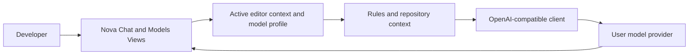

# Nova Architecture

Nova is developed as a VS Code fork instead of a greenfield editor. The fork keeps VS Code's mature editor, workbench, extension host, language server integrations, SCM support, terminal, and marketplace-compatible extension model. Nova adds an AI-first product layer through a built-in extension and a small set of workbench branding changes.

## Product Direction

Cursor's public product shape centers on agentic coding, repository-aware chat, model selection, rules, and tool integrations. Nova follows the same category, but makes user-controlled model routing a first-class requirement:

- OpenAI-compatible base URL, model ID, API key, and temperature are user settings.
- All Nova AI commands use the same user-selected runtime.
- Multiple model profiles can be created, switched, edited, and deleted without changing code.
- Provider presets cover common hosted and local OpenAI-compatible endpoints while keeping a custom provider path.
- Profiles can require API keys for hosted providers or run without keys for local OpenAI-compatible servers such as Ollama and LM Studio.
- Profiles can add custom non-reserved HTTP headers for enterprise gateways, routers, tenants, and project metadata.
- Profiles can add custom non-reserved request body fields for provider-specific generation controls and router options.
- Active model profiles can be tested through the same OpenAI-compatible request path used by chat.
- API keys are stored per model profile through VS Code SecretStorage when using `Nova: Set Model API Key`.
- A built-in Nova Models view manages profiles, auth mode, custom headers, API keys, and connection testing without leaving the side bar.
- Workspace rules are loaded from Nova and Cursor-compatible rule files, with a built-in Rules view for editing `.nova/rules.md`.
- Repository context snippets are selected from workspace files and added to model requests.
- The workspace agent turns small requests into structured multi-file plans and applies them only after review.
- Inline completions use the active model profile and bounded cursor-local context.
- First-run setup prompts users to connect a provider and contributes a walkthrough for onboarding.
- Provider lock-in is avoided by keeping the request protocol simple and documented.
- The first integration point is a built-in VS Code extension so the feature can ship quickly inside a fork.

## Repository Layout

- `extensions/nova-ai`: Built-in extension that contributes the Nova chat view, commands, settings, and custom model client.
- `scripts/bootstrap-vscode.ts`: Clones or updates the upstream VS Code repository into `vendor/vscode`.
- `scripts/apply-overlay.ts`: Copies Nova-owned extension and product overlay files into a VS Code checkout.
- `scripts/verify-overlay.ts`: Confirms the Nova overlay is present in the VS Code checkout.
- `scripts/build-vscode-fast.ts`: Runs the upstream fast VS Code build with the project-local Node runtime.
- `scripts/start-vscode.ts`: Launches the Nova VS Code fork through the upstream start script.
- `scripts/acceptance-vscode-model.ts`: Starts a local OpenAI-compatible mock server and runs Nova inside VS Code extension-test mode to verify custom model routing end to end.
- `overlays/vscode/product.json`: Branding and product metadata for the fork.
- `docs/vscode-fork-plan.md`: Practical fork workflow and integration checklist.

## VS Code Fork Strategy

1. Track upstream `microsoft/vscode` in `vendor/vscode` or in a sibling fork remote.
2. Keep Nova changes as a small overlay where possible: built-in extension, product metadata, icons, and workbench contribution points.
3. Prefer extension APIs for AI features before editing VS Code core. Core patches should be reserved for custom account systems, marketplace policy, native model routing UI, or deep editor UX changes.
4. Build and test the extension independently, then copy it into the fork's `extensions/` directory as a built-in extension.

## AI Integration

The first AI path is deliberately simple:

The extension sends the current active file path, language, content, workspace rules, and bounded repository context alongside the user's prompt. It calls `${nova.modelBaseUrl}/chat/completions` unless the configured URL already ends with `/chat/completions`. Nova Chat requests stream responses with OpenAI-compatible Server-Sent Events when the provider supports them, with a non-streaming fallback for compatible JSON responses. Authorization headers are included only when the active profile has an API key; no-key local profiles call the same OpenAI-compatible path without a bearer token. Custom profile headers are merged into every model request, while reserved headers such as `Authorization`, `Content-Type`, `Content-Length`, and `Host` remain controlled by Nova. Custom profile body fields are merged into the OpenAI-compatible JSON payload for provider-specific parameters such as `top_p`, `max_tokens`, and router options, while reserved fields such as `model`, `messages`, `stream`, and `temperature` remain controlled by Nova.

The automated model acceptance check uses the same path: it launches the fork, activates extension ID `nova.nova-ai`, writes temporary Nova settings, and confirms the mock provider receives `/v1/chat/completions` requests with the configured model ID, bearer token, custom headers, custom body fields, and a streaming SSE request.

Implemented commands:

- `Nova: Open Chat`: Opens the built-in Nova chat view.
- `Nova: Setup`: Opens the first-run setup flow for configuring and testing a model provider.
- `Nova: Configure Model`: Opens the Nova Models view for profile management, auth mode, headers, API key storage, and connection testing.
- `Nova: Configure Model (Quick Pick)`: Opens the legacy keyboard-first model setup flow.
- `Nova: Open Rules`: Opens the Nova Rules view for editing `.nova/rules.md` and inspecting loaded rule sources.
- `Nova: Explain Current File`: Sends active editor context to the configured model.
- `Nova: Generate Tests`: Requests test suggestions for the active editor.
- `Nova: Run Agent`: Requests a bounded workspace edit plan, previews each file diff, and applies approved changes.
- `Nova: Open Agent Tasks`: Opens recent `.nova/plans/` and `.nova/runs/` Agent records in the side bar.
- `Nova: Edit Selection or File`: Rewrites the current selection, or the whole file when no selection exists.
- `Nova: Set Model API Key`: Stores the provider key in SecretStorage for the active profile.
- `Nova: Configure Model`: Provides one setup surface for creating, switching, editing, key storage, deletion, and connection testing.
- `Nova: Create Model Profile`: Saves a reusable provider/model profile.
- `Nova: Switch Model Profile`: Routes all Nova AI actions through the selected profile.
- `Nova: Edit Active Model Profile`: Updates the active provider base URL, model ID, label, or temperature.
- `Nova: Delete Model Profile`: Removes a saved custom profile and falls back to the default profile when needed.
- `Nova: Test Model Connection`: Sends a small request through the active profile and reports latency/errors.

Rule sources:

- `.nova/rules.md`
- `.cursorrules`
- `.cursor/rules/**/*.md`
- `.cursor/rules/**/*.mdc`

## Agent Guardrails

The current agent is intentionally bounded. Before producing a final edit plan, it can ask the selected model for a small read-only inspection plan using only `search` and `read`. Nova executes those inspections itself with workspace path validation, excluded folders, result limits, and bounded file excerpts, then includes the inspection results in the final planning prompt. The final plan is JSON with a short summary, full replacement content per file, and optional validation commands. Nova writes the plan to `.nova/plans/` and opens it for review before applying. If the user approves, Nova validates relative workspace paths, rejects parent-directory traversal and excluded folders, limits the number and size of file changes, writes preview files under `.nova/previews`, and requires per-file confirmation before writing.

Every agent run writes a Markdown report under `.nova/runs/` with the summary, inspection evidence, applied/skipped files, and validation command output. The report gives users a durable review trail while keeping model-proposed workspace edits blocked from writing into `.nova` directly.

The Agent Tasks view scans `.nova/plans/` and `.nova/runs/`, lists recent records, and reopens the selected Markdown document. This keeps the first task history feature extension-scoped while leaving room for a richer task timeline UI later.

Terminal execution is also bounded. Nova allows only non-interactive validation/status commands from a small allowlist: package-manager `test`/`typecheck`/`lint`/`build`, `tsc --noEmit`, `node --version`, `tsx` scripts without shell operators, and read-only `git status`/`git diff`/`git log`/`git show`. Shell operators, redirects, network utilities, destructive commands, permission changes, process killing, and publishing-style workflows are rejected before execution. User-facing agent runs ask before each command.

## Inline Completion

Nova contributes a VS Code inline completion provider over all text files. The provider can be disabled through `nova.inlineCompletion.enabled`. Requests use the same active model profile, but the prompt is specialized for short insertions and only includes bounded prefix/suffix cursor context rather than repository-wide context.

## Next Core Fork Changes

- Add Nova branding to `product.json`, icons, and update channels.
- Preinstall `nova-ai` as a built-in extension.
- Add account/provider polish around the first-run model setup walkthrough.
- Add a workbench title/menu entry for Nova Chat.
- Expand agent tool execution from structured file plans into search, terminal, test, and git workflows using VS Code's workspace APIs.

## Reference Material

- VS Code Extension API: https://code.visualstudio.com/api
- VS Code Webview API: https://code.visualstudio.com/api/extension-guides/webview
- VS Code Contribution Points: https://code.visualstudio.com/api/references/contribution-points
- VS Code source contribution guide: https://github.com/microsoft/vscode/wiki/How-to-Contribute
- Cursor docs: https://cursor.com/docs
